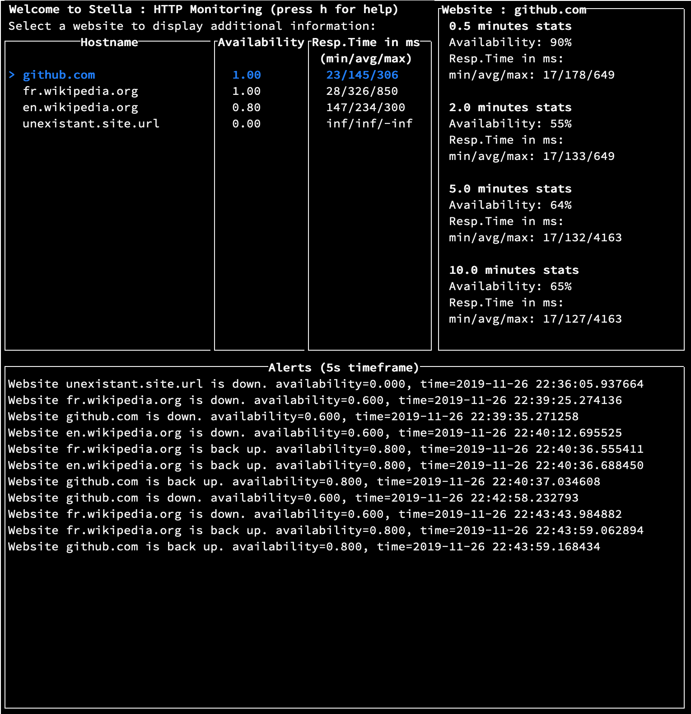
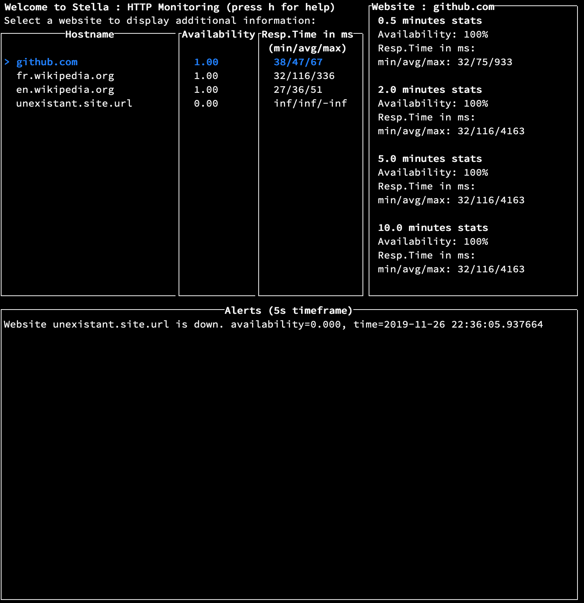
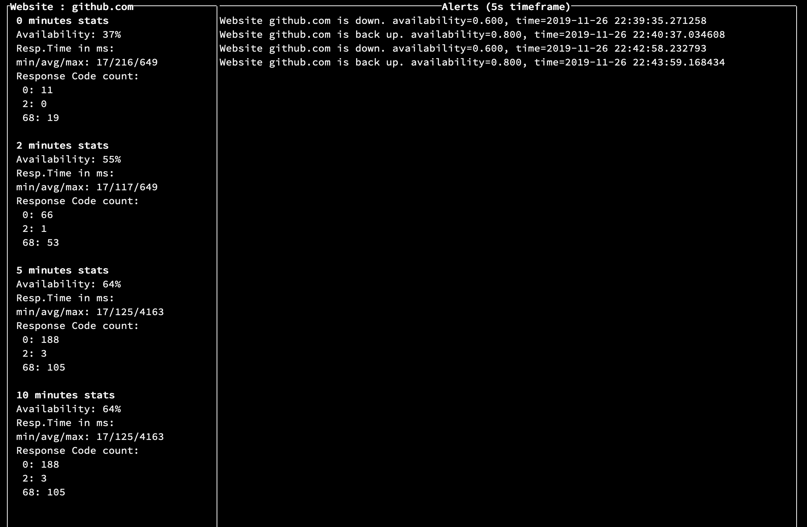

# Stella

## About

Stella is a console program which monitors availability and performance of websites.

Stella can monitors websites either through HTTP or ICMP.


## Table of contents

- [Stella](#stella)
  - [About](#about)
  - [Table of contents](#table-of-contents)
  - [Setup](#setup)
    - [Requirements](#requirements)
      - [Note for Windows users](#note-for-windows-users)
    - [Installation](#installation)
    - [Configuration](#configuration)
    - [Running](#running)
    - [Run Tests](#run-tests)
    - [Running without installation](#running-without-installation)
  - [Architecture](#architecture)
    - [Testing](#testing)
    - [Projet structure](#projet-structure)
  - [Improvements](#improvements)
    - [Features](#features)
    - [Implementation](#implementation)
    - [Known issues](#known-issues)

## Setup

### Requirements

- Linux, MacOS or Windows.
- Python 3.7

#### Note for Windows users

This program uses the included _curses_ library. As the regular Windows Python distribution does not include the _curses_ library  used for the console dashboard, the _windows-curses_ library is required.

### Installation

To install from source in a virtualenv:

- `python setup.py install`

### Configuration

- Modify the websites you would like to monitor in the `websites.conf` file.
Each line consists of a valid HTTP URL (as described in the [RFC 3986](https://tools.ietf.org/html/rfc3986)), and an integer representing the check interval in seconds (i.e how often to ping the website). Both arguments are separated by a space. You can add any number of websites.

- By default, the app will monitors website through http. To change this setting, set `MONITOR_HTTP_RATHER_THAN_ICMP` to `False` in the Stella configuration file (`stella/config.py`)

- By default, the app will compute and display stats (such as averages) based on certain timeframes. You can change them or add any number of timeframes in the `STATS_TIMEFRAMES` in the configuration file.

- The app will send alerts when the website availability during a certain timeframe (the `ALERTING_TIMEFRAME`) drops below a given threshold (the `DEFAULT_ALERT_THRESHOLD`) in the configuration file.

__Note: You may have to run `python setup.py install` again for the changes in the `stella/config.py` file to be applied to your installation__. See [Running without installation](#running-without-installation) Running without installation if you wish to modify the config file often.

### Running

- Run `stella` to launch the app once you have configured it to your need.
- The app has a main window where you can see for each websites the metrics used for the alerting, as well as all the alerts for the application
- You can also review the detail of all the gathered metrics for each website by selecting it and pressing `Enter`
- A help menu can help you if you get lost.





### Run Tests

- Run `pytest`

### Running without installation

If you do not want to install the program:

- run stella with `python main.py` (no dependencies)
- run tests with `python -m pytest` (requires `mock` and `pytest`)

## Architecture

The architecture is divided into 3 main components:

- The _App_, which acts as the program controller.
- The _Dashboard_, which presents information to the user.
- Several _Websites_, which contain a Stats object per `STATS_TIMEFRAMES`

The _App_ runs a monitoring thread per _Website_, which fetches new data (by pinging the server) at each website's given `check_interval`, updates several website stats, and eventually creates an _Alert_.

The Dashboard is based on the curses library, and refreshes upon user input, or every so often (see `CONSOLE_REFRESH_INTERVAL`).

### Testing

Currently, there are only tests for the alerting functionality as well as some stats computation is tested.
In order to test the alerting functionality, we simulate a server being down and being back up (using mocking functions).

### Projet structure

```
.
├── README.md
├── images
├── main.py
├── requirements.txt
├── setup.py
├── stella
│   ├── __init__.py
│   ├── alert.py
│   ├── app.py
│   ├── config.py
│   ├── dashboard.py
│   ├── helpers.py
│   ├── stats.py
│   └── website.py
├── tests
│   └── unit
│       ├── test_stats.py
│       └── test_website.py
└── websites.conf
```

## Improvements

### Features

- Add more stats, such as the 95th or 99th percentile of response times, which would provide a better insight into the health of the website than the average.
- Better display the alert codes based on their signification for the website pages.
- Alerting configuration : the alert checking is hardcoded for the availability metric. Add the ability to specify several alert checks and types, for example through an alerting config file specifying for each metric, the website, threshold and timeframe to monitor.
- Ability to save the stats in memory so that if the program is stoped shortly to reload the website list, we do not loose the stats from the previous minutes/hours/etc. Alternatively, add the ability to add a website from the Dashboard or hot-reload the `websites.conf` file.

### Implementation

- When parsing the `websites.conf` conf files, Errors are not handled : improve parsing (check integer and url integrity) to help the user identify when there is an error in the config file.
- The `website.ping` `subprocess.run` call (to the system ICMP ping) blocks the thread, therefore the app. This therefore currently represents the main program bottleneck. For example, if connection is poor and ICMP ping takes more than 1 second, no more than one website will be able to update its stats every seconds. This is why we currently default the monitoring to HTTP.
- Website monitoring is done with one thread per website. Due to the python Global Interpreter Lock, they do not run concurrently, allowing potential bottlenecks (such as above) for the program.
- The `app.alert_history` is shared among all websites : replace the object sharing by using producer/consumer queue per website, whereby each websites produces alerts and the main thread consumes them to save in the main alert history.
- Stats objects are built based on the assumption that stats will be updated every check_interval. If for some reason the stats are not updated (for exemple if the host machine freezes), the stats do not really represent the last time timeframe of data. Therefore, we need to add the notion of timestamp for each new data, and compute stats based on the timestamps. The data from the metrics queues will be poped, up to data whose timestamp is in the timeframe.

### Known issues

See the [Github issue tracker](https://github.com/Japillow/Stella/issues)
